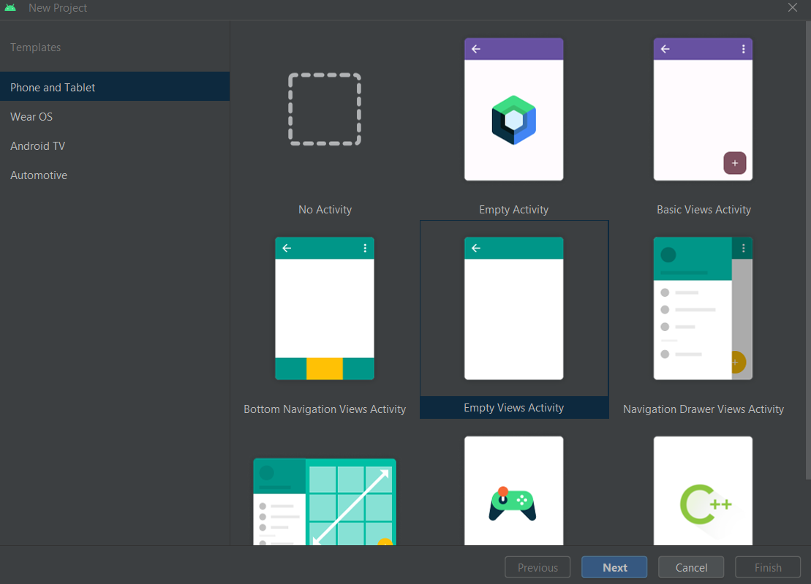
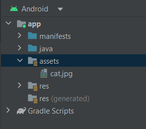
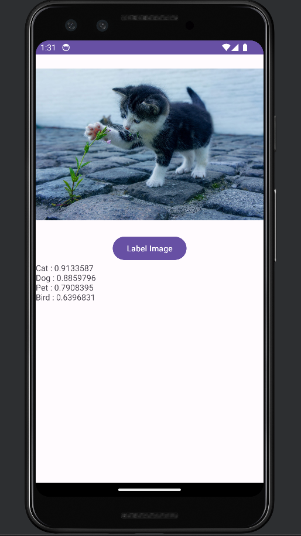

## ## **Computer Vision (Image Classification) App on Android**

**Introduction**: Computer Vision is like teaching computers to understand pictures better. In the past, computers could only remember how pictures looked, like the colors of all the dots. But with Computer Vision, computers can now look at pictures and figure out what's in them. For instance, in Computer Vision, if there's a picture of a cat, the computer can not only see the cat but also say, "Hey, there's a cat in this picture!" It's like the computer is getting smarter about pictures. There are various parts of Computer Vision. One part is called "Object Detection." It's when the computer looks at a picture and not only says what's in it but also draws boxes around the things it sees, so you know exactly where they are.

**Objective**: In this repository, I’ve built an app that manages the core use case, detecting the primary contents of the image. This is called *Image Classification* or Image Labeling. To keep the app as simple as possible, it has used images that are bundled with it as resources and show a classification from them. Future extensions could be to use an Image Picker or pull images directly from the camera.

**Working Procedure:**

## **A. Creating New Project**

1.  Opened Android Studio, went to the File menu and selected Create a New Project.
2.  As it asked me to pick a project template, I selected Empty Views Activity, as it automatically creates an “activity_main.xml” file connecting it to the “MainActivity.kt” file.

3.  After clicking next, I was asked to Configure the project. I gave it the name “ImageClassifierStep1” and the package name “com.google.dervel.imageclassifierstep1”.

4.  Then I chose Kotlin as the preferred language and clicked Finish. Android Studio then created the app for me.

## **B. Import ML Kit's Image Labeling Library**

ML Kit is a toolbox for developers. It helps with common Machine Learning tasks and works on different devices. ML Kit has a ready-made tool called Image Labeling that you can easily use in your app. This tool can recognize more than six hundred types of images right away, making it great for beginners. One can also create their own custom models with ML Kit. In this scenario, I have built an animal recognizer. When I created this first app and showed it a picture of a cat, it recognized it as a cat with maximum value.

Here are the steps:

1.  In Android Studio, using the project explorer, selected Android at the top.
2.  Opened the Gradle Scripts folder, and selected the build.gradle(Module: app) file for the app.

3.  At the bottom of the file, in the “dependencies” section, I have added a dependency to the file with this code:

    implementation 'com.google.mlkit:image-labeling:17.0.3'

4.  Then to resync the file, I have clicked on the little elephant icon in the toolbar at the top right.

Now the ML Kit has been imported, and it is ready to start image labeling.

## **C. Build the User Interface**

Now to design the layout, I opened the activity_main.xml file from the res \> layout folder in Android's project explorer – like this:

Then wrote the tags (ImageView, Button and TextView) to have the user interface defined.

## **D. Bundle Images with the App**

One way to bundle extra files with an Android app is to add them as assets that get compiled into the app.

1.  In the project explorer, on the app at the top, right clicked and selected New \> Folder \> Assets Folder.

An asset folder was created after this.

2.  Right clicked this folder, and a popup with a list of options appeared. One of these was “Open in Explorer” which opened the folder in my file system.

3.  Copied an image file downloaded from Pixabay into the asset folder. Renaming the image into “cat.jpg”

## **E. Write the Classification Code to Label the Image**

I wrote my code in the MainActivity file which was located in the project folder under “com.google.devrel.imageclassifierstep1”.

Let us break down the steps:

1.  Initializing Views: Started by initializing the views in your app's layout, created instances of objects like ImageView, TextView, and Button based on their IDs defined in your XML layout file.
2.  Loading an Image: Loaded an image from your app's assets folder and display it in the ImageView. The image is loaded as a bitmap, which is a digital representation of the image.
3.  Setting Up the Button: Set up a button that the user can click to perform image labeling. When the button is clicked, a series of actions will be triggered.
4.  Creating an Image Labeler: Inside the button's click listener, created an Image Labeler using ML Kit. This labeler is responsible for recognizing objects in the image.
5.  Processing the Image: Converted the loaded bitmap into a format that ML Kit can work with, called InputImage. Then, I have used the Image Labeler to process this image, which involves identifying objects or labels within the image.
6.  Handling Results: After the successful image labeling, I have received a list of labels with associated confidence scores, extracted these labels and displayed them in the TextView, showing what objects were recognized in the image.
7.  Error Handling: If there is an issue during the image labeling process, the exception handler portion will manage it by capturing exceptions and possibly informing the user of the problem.
8.  Overall, this code sets up your Android app to perform image labeling using ML Kit when the user clicks a button. It takes an image from the assets, processes it, and displays the recognized labels.

Here you can see that the label determined there were high probabilities that the image contained a cat, a dog, a pet, or a bird. These are all animals but the correct one is with the highest probability, which is for a cat, and they are all demonstrating that the model is working to parse the image. But it cannot yet determine that this is a picture of a daisy. For that it needs a custom model that was trained on specific animal images.
